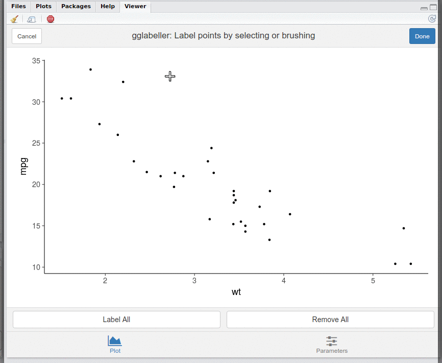
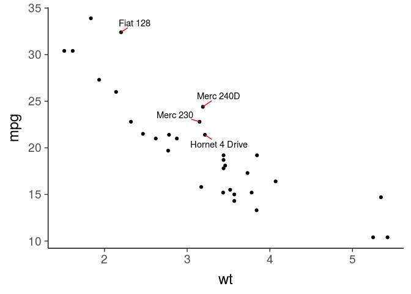
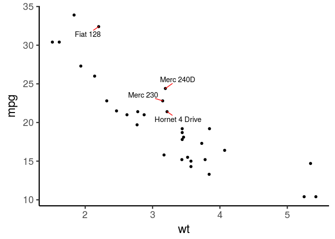

<!-- README.md is generated from README.Rmd. Please edit that file -->

# gglabeller

R package with one main function, gglabeller, which launches a simple
shiny gadget that enables selecting points on a ggplot to label. Label
positions are determined using the fantastic
[ggrepel](https://github.com/slowkow/ggrepel) package.

Note: gglabeller has been recently updated to be compatible with ggplot2
version 3.0 – if encountering issues with previous versions of
gglabeller after updating ggplot2, please try updating gglabeller to
version 0.3.0 or higher\! (and gglabeller 0.3.0+ now requires ggplot2
\>= 3.0)

# Installation

Installation via devtools:

``` r
devtools::install_github("AliciaSchep/gglabeller") 
```

# Usage

First create a plot using ggplot2 and save it to a variable:

``` r
library(gglabeller)
library(ggplot2)
library(ggrepel)

p <- ggplot(mtcars, aes(x = wt, y = mpg)) + geom_point() + 
            theme_classic(base_size = 18)
```

Pass the variable to gglabeller:

``` r
gglabeller_example <- gglabeller(p, aes(label = rownames(mtcars)))
```

Running gglabeller will open a shiny gadget in the RStudio viewer pane
(or in the browser if running R in the terminal). You can click or brush
over points to select them for labelling. Clicking over an already
labelled point or brushing over a set of points that have all been
labelled will remove the labels.



You can also modify the ggrepel parameters via the “Parameters” tab in
the app.


After clicking done, the returned object is a list storing the resulting
plot and a code snippet for recreating the plot de novo.

We can make a static version of the plot to save:

``` r
gglabeller_example$plot
```

<!-- -->

The code snippet can be useful if you want to incorporate the plot
creation into a reproducible script:

``` r
gglabeller_example$code
#> [1] "set.seed(1502996);gglabeller_data <- p$data; gglabeller_data$gglabeller_labels <- rownames(mtcars); gglabeller_data[c(1:3, 5:7, 10:17, 19:32),'gglabeller_labels'] <- ''; p + geom_text_repel(data = gglabeller_data,mapping = aes(label = gglabeller_labels), segment.color = 'red',box.padding = unit(0.5, 'lines'))"
```

``` r
library(magrittr)
gglabeller_example$code %>% parse(text = .) %>% eval()
```

<!-- -->

You can also just get out the indices of the labelled points:

``` r
gglabeller_example$ix
#> [1]  4  8  9 18
```

This can be used to get out the labels themselves.

``` r
rownames(mtcars)[gglabeller_example$ix]
#> [1] "Hornet 4 Drive" "Merc 240D"      "Merc 230"       "Fiat 128"
```

## Text and label properties

Parameters to ggrepel, including additional text and label properties
(the `...` arguments to `geom_text_repel` or `geom_label_repel`), can
also be passed in to `gglabeller`.

For example, the following will result in bold red font for the labels
in the
app:

``` r
gglabeller(p, aes(label = rownames(mtcars)),  fontface = "bold", color = "red")
```

# Limitations

Requires points to label; not targetted at line plots or other non-point
plots.

Relies on shiny’s nearPoints and brushedPoints functions, which require
that the ‘x’ and ‘y’ aesthetics be mapped to a column name and not a
transformation. For example, `ggplot(mtcars, aes(x = log(wt), y = mpg))`
will not work because the x aesthetic is mapped to a transformation of
the column. For such a plot, one could modify the input first to create
a column with the log of the value.
